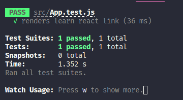
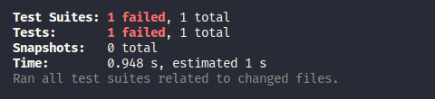

# Welcome to Foodle-Tdd

**Author: Brendan Tuckerman**

## About

This project was done via Test Driven Development with Jest, and an exmplar project.

## Steps

Just start your project normally with 

`npx creat-react-app new-testing-project`

`cd` into the project and open it in a text editor. Navigate tyo the `package.json`, where you can see the test library for Jest is already installed.

In fact, the default app in React already has a test built in, and so you can run one straight away.

The test is found in `app.tests.js` and it is testing whether the default app renders a react link. You can run `npm run test` in the console, and see the test run. As long as you have not  made any changes to the app, it should pass:



Then go ahead and delete the words 'Learn React' from line 18 of the `app.js` file. You wil see that the tests will run again, but this time give you a failing message.




Note that Jest will look for any files that have the `.test.js` or `.spec.js` suffix, or **any** files in the `__tests__` folder (which can be anywhere under the `src` folder.). 

## Starting your own tests

You can start with some really basic tests, just to see whether a component is rendered. 

I started by building a component, `<Dashboard/>` that was going to be my main page, allowing the user to select ingredients whhich would be later sent as an API request for recipes.

To begin with, I simply set a basic <h1> title and a basic test

```Javascript
    import Dashboard from "../Components/Dashboard";
    import { screen, render } from "@testing-library/react";

    test('Renders the Dashboard', () => {
        render(<Dashboard/>);

    })


```

This test will `pass` if the component renders, which it should if you have exported it to `App.js`.

Of course, we need our component to do more than just render, so now we can start to test whether other features on the page that are also present. We can write our first test with `expect`, which checks whether something we, well, *expect* is on the page. Here we test that the title says 'Welcome to Foodle'

```JavaScript

test('Renders the Dashboard', () => {
    render(<Dashboard/>);
    expect(screen.getByRole("heading")).toHaveTextContent(/Welcome to Foodle/);
})


```

This wil pass because we have out heading already on the page and we are now ready to take the leap into full-blow Test Driven Development, by writing a test we know will not pass:

```JavaScript
    //...
     expect(screen.getByRole("inputfield")).toHavePlaceholderText("What is in your fridge?");
     

```

# Getting Started with Create React App

This project was bootstrapped with [Create React App](https://github.com/facebook/create-react-app).

## Available Scripts

In the project directory, you can run:

### `npm start`

Runs the app in the development mode.\
Open [http://localhost:3000](http://localhost:3000) to view it in your browser.

The page will reload when you make changes.\
You may also see any lint errors in the console.

### `npm test`

Launches the test runner in the interactive watch mode.\
See the section about [running tests](https://facebook.github.io/create-react-app/docs/running-tests) for more information.

### `npm run build`

Builds the app for production to the `build` folder.\
It correctly bundles React in production mode and optimizes the build for the best performance.

The build is minified and the filenames include the hashes.\
Your app is ready to be deployed!

See the section about [deployment](https://facebook.github.io/create-react-app/docs/deployment) for more information.

### `npm run eject`

**Note: this is a one-way operation. Once you `eject`, you can't go back!**

If you aren't satisfied with the build tool and configuration choices, you can `eject` at any time. This command will remove the single build dependency from your project.

Instead, it will copy all the configuration files and the transitive dependencies (webpack, Babel, ESLint, etc) right into your project so you have full control over them. All of the commands except `eject` will still work, but they will point to the copied scripts so you can tweak them. At this point you're on your own.

You don't have to ever use `eject`. The curated feature set is suitable for small and middle deployments, and you shouldn't feel obligated to use this feature. However we understand that this tool wouldn't be useful if you couldn't customize it when you are ready for it.

## Learn More

You can learn more in the [Create React App documentation](https://facebook.github.io/create-react-app/docs/getting-started).

To learn React, check out the [React documentation](https://reactjs.org/).

### Code Splitting

This section has moved here: [https://facebook.github.io/create-react-app/docs/code-splitting](https://facebook.github.io/create-react-app/docs/code-splitting)

### Analyzing the Bundle Size

This section has moved here: [https://facebook.github.io/create-react-app/docs/analyzing-the-bundle-size](https://facebook.github.io/create-react-app/docs/analyzing-the-bundle-size)

### Making a Progressive Web App

This section has moved here: [https://facebook.github.io/create-react-app/docs/making-a-progressive-web-app](https://facebook.github.io/create-react-app/docs/making-a-progressive-web-app)

### Advanced Configuration

This section has moved here: [https://facebook.github.io/create-react-app/docs/advanced-configuration](https://facebook.github.io/create-react-app/docs/advanced-configuration)

### Deployment

This section has moved here: [https://facebook.github.io/create-react-app/docs/deployment](https://facebook.github.io/create-react-app/docs/deployment)

### `npm run build` fails to minify

This section has moved here: [https://facebook.github.io/create-react-app/docs/troubleshooting#npm-run-build-fails-to-minify](https://facebook.github.io/create-react-app/docs/troubleshooting#npm-run-build-fails-to-minify)
